 
 
#[fit] Introduction to Data Science
 

 

>  **Amit Kapoor**
>  **Bargava Subramanian**

---

# Welcome

---

# Amit Kapoor
## *@amitkaps*

---

# Bargava
## *@bargava*

---

# Agenda

---

---

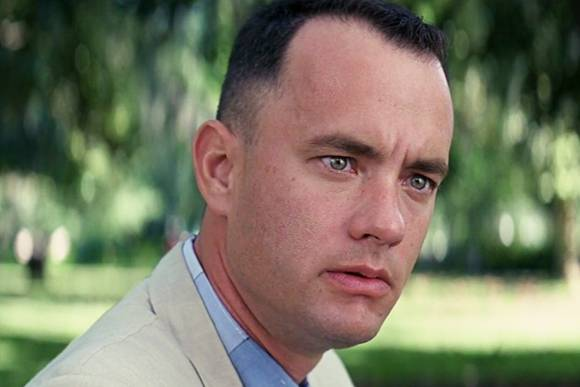

---

##[fit] Be Curious | Have Fun

---
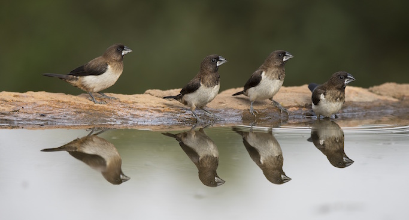

---

#[fit] How many birds remain on the tree?

- **P(Hunter to hit target) = 0.2**
- **Number of birds n = 150**
- **Shots = 3**
- **Birds hit = 1**

---

 
 

#[fit] Domain knowledge is very important
 

*Don't lose the big picture*

---

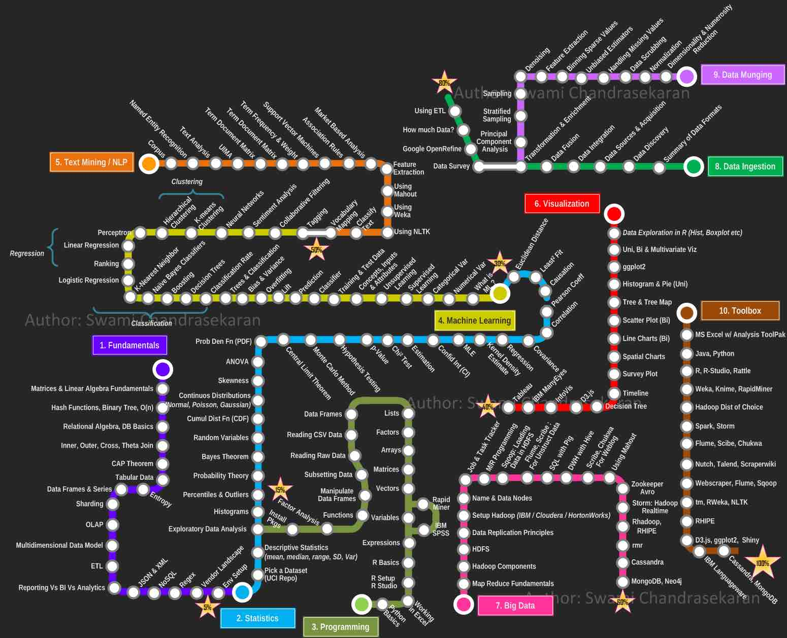
#[fit] What is Data Science?

---

# See the world through a data lens

---

#[fit] Information != Understanding

---

 
 

#[fit] "Data is just a clue to the end truth"
-- *Josh Smith*

---

# Data Driven Decisions

---

# "Science is knowledge which we understand so well that we can teach it to a computer. Everything else is art"
-- Donald Knuth

---

# Data Science is an Art

---

# Hypothesis Driven Approach

---

# Frame
## "An approximate answer to the right problem is worth a good deal"

---

# Frame
- Toy Problems
- Simple Problems
- Complex Problems
- Business Problems
- Research Problems

---

# Types of Questions

- Descriptive
- Exploratory
- Inferential
- Predictive
- Causal
- Mechanistic

---

 
 
# Descriptive

 How many people signed up for today's event?

---

 
 

# Exploratory

How many people turned up from each company ? 

---

 
 

# Inferential

How many managers signed up and amongst them how many turned up? Is there a correlation with the company they come from?

---

 
 

# Predictive

Given that Ms. X has come for the previous workshop, will she turn up for today's workshop?

---

 
 

# Causal

Why did more people from a particular company turn up for today's workshop?

---

 
 

# Mechanistic

If more managers from a particular company turn up, how many more employees will turn up for the workshop? 

---

# Acquire
## "80% perspiration, 10% great idea, 10% great output"

---

# Acquire
- **Scraping** (structured, unstructured)
- **Files** (csv, xls, json, xml, pdf, ...)
- **Database** (sqlite, ...)
- APIs
- Streaming

---

# Refine
## "All data is messy."

---

# Refine
- Data Cleaning (inconsistent, missing, ...)
- Data Refining (derive, parse, merge, filter, convert, ...)
- Data Transformations (group by, pivot, aggregate, sample, summarise, ...)

---

# Explore
## "I don't know, what I don't know."

---

# Explore
- Simple Vis
- Multi Dimensional Vis
- Geographic Vis
- Large Data Vis (Bin - Summarise - Smooth)
- Interactive Vis

---

# Model
## "All models are wrong, but some are useful"

---

# Model - Supervised Learning
- *Continuous: Regression* 
- *Discrete: Classification*

---

# Model - Supervised Learning
- *Continuous: Regression* : 
What will be the annual revenue for 2017 ?

---

# Model - Supervised Learning

- *Discrete: Classification* : 
Will company XYZ buy from us? 

---

# Model - Supervised Learning
- *Continuous: Regression* 
- *Discrete: Classification*

**Algorithms:**

Linear Regression, Logistic Regression,  CART, Random Forest, Gradient Boosting Machines, K-Nearest Neighbor, Support Vector Machines, Naive-Bayes, Bayesian Networks 

---

# Model - Unsupervised Learning

- *Cluster Analysis*
- *Dimensionality Reduction*

---

# Model - Unsupervised Learning

- *Cluster Analysis* : 
If we segment our customers into three types, what would they look like?

---

# Model - Unsupervised Learning

- *Dimensionality Reduction* : 
Data is too huge to load into memory. Is there a better representation of the data?

---

# Model - Unsupervised Learning
*Cluster Analysis*: K-means, DBSCAN

*Dimensionality Reduction*: Principal Component Analysis, Singular Value Decomposition, MDS

---

# Model - Advanced / Specialized
- Deep Learning
- Network / Graph Analytics
- Optimization
- Reinforcement Learning
- Online Learning

- Applications: Time Series, Text, Image, Speech

---

# Insight
## "The goal is to turn data into insight"

---

# Insight
- Narrative Visualisation
- Dashboard Visualisation
- Decision Making Tools
- Automated Decision Tools

---

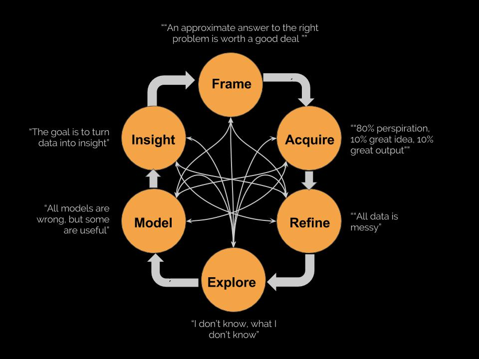

---

## "Doing data analyis requires quite a bit of thinking and we believe that when you’ve completed a good data analysis, you’ve spent more time thinking than doing."
-- Roger Peng

---
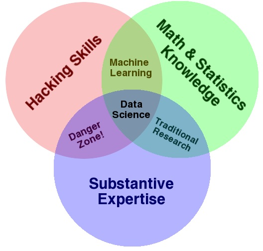

#[fit] What are the key skill areas for Data Science

---

---

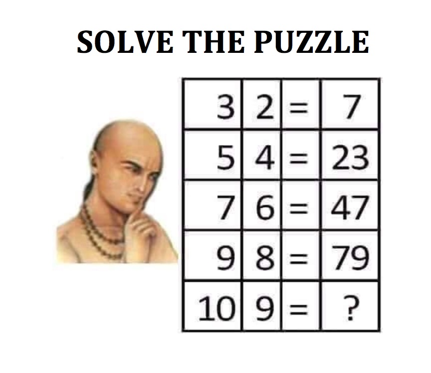

---

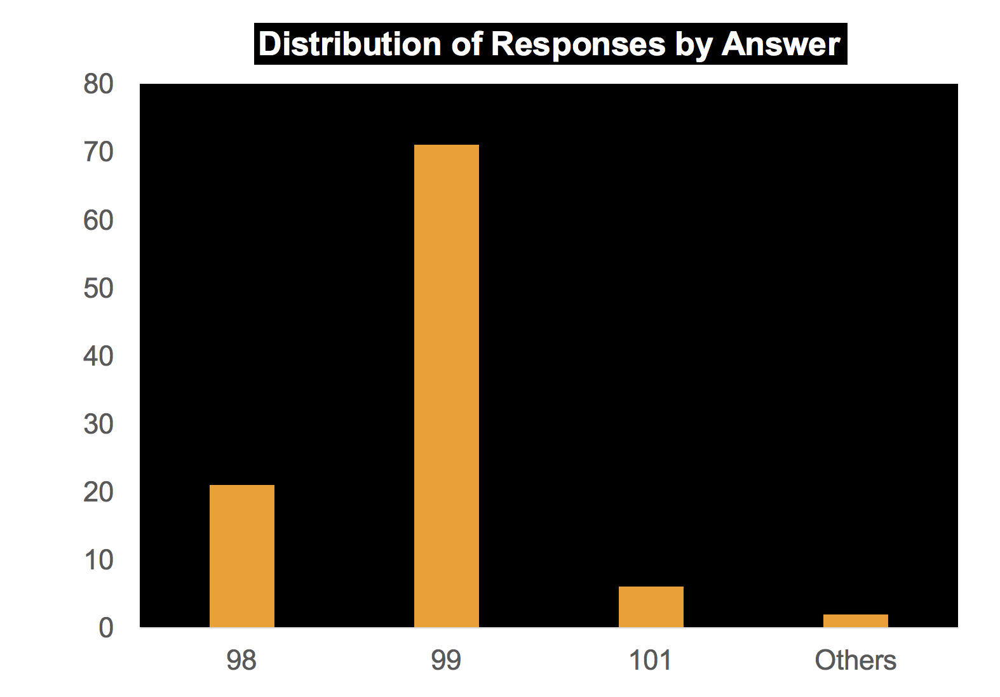

---

# 99   (x*y + odd counter)

 
---

# 98   (x*y + y - 1)
 
---

# 101   (x*y + {1, prime counter})
 
---

#[fit] *Stakeholder/Client wants an answer*

# Wisdom of crowds?

---

#[fit] Throw one more to the fire
## 98 : (x^2 - 2)
 
---

 
 

#[fit] Occam's Razor

*Problem solving principle*: Amongst competing hypotheses, the one with the fewest assumptions should be selected

---

# Different Profiles in Data Science

---

### Different Profiles in Data Science

- Data Analyst
- Data Engineer
- Data Visualization
- Data SME
- Data Scientist

---

# Data Analyst

A budding/junior data scientist. Supports EDA and data wrangling. 

*Typical skills:* 
- Good with Excel. 
- Basic knowledge of R/Python/SQL

---

# Data Engineer

Builds and supports the data pipeline. Data Architect. 

*Typical skills:* 
- SQL
- Spark
- Hadoop/Cassandra
- Data Orchestration(Eg: Luigi)

---

# Data Visualization

Builds visualization

*Typical skills:*
- Tableau/Qlik/D3.js 
- Basics of HTML/JavaScript

---

# Data SME

The data guru. Understands business impact of each of the attribute stored in the system. 

*Typical skills:* 
-Domain knowledge +  system architecture

---

# Data Scientist

---

---
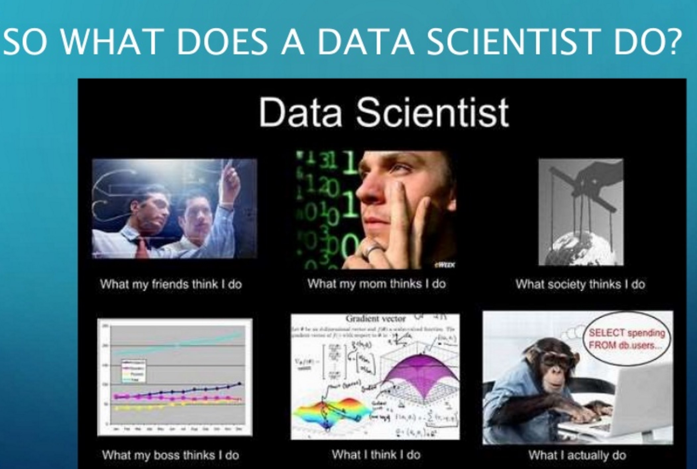

---

# Data Scientist

Builds models and find insights.

*Typical skills:* 

- R
- Python
- Spark
- Machine Learning
- Math/Statistics
- Business Knowledge

---

#  Data Analyst   Vs   Data Scientist? 

---

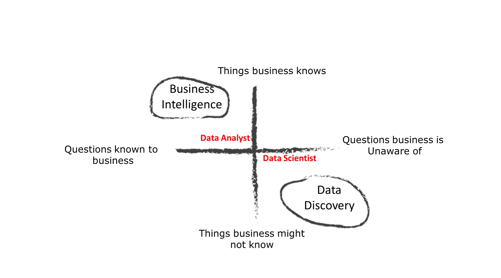

---

---

# Selection Bias ! 

---

# Skills
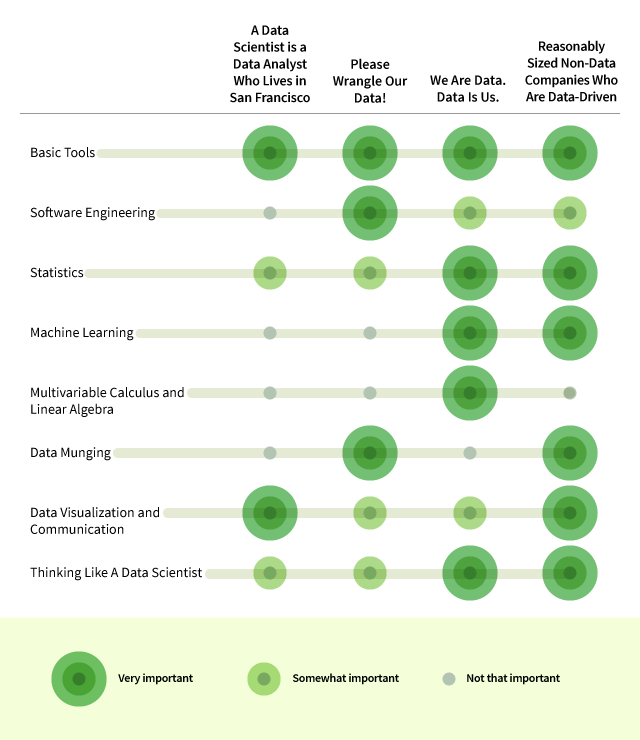

---

---

# R Stack
- **Acquire**: `rvest, XML, jsonlite, httr, RSQLite, RPostgreSQL, readxl, haven, readr, data.table` 
- **Refine**: `dplyr, tidyr, lubridate, stringr`
- **Explore**: `graphics, ggplot2, ggvis, ggmap, map, vcd, rgl, htmlwidgets, leaflet, choroplethr, plotly`
- **Model**: `stats, caret, ranger, glmnet, xgboost, party, mxnet, forecast`
- **Insight**: `OpenCPU, Rserve, shiny, RMarkdown, knitr`

---
# PyData Stack 
- **Acquire / Refine**: `Pandas, Beautiful Soup, Selenium, Requests, SQL Alchemy, Numpy, Blaze`
- **Explore**: `MatPlotLib, Seaborn, Bokeh, Plotly, Vega, Folium`
- **Model**: `Scikit-Learn, StatsModels, SciPy, Gensim, Keras, Tensor Flow, PySpark`
- **Insight**: `Django, Flask`

---
# A day in the life of a Data Scientist

---

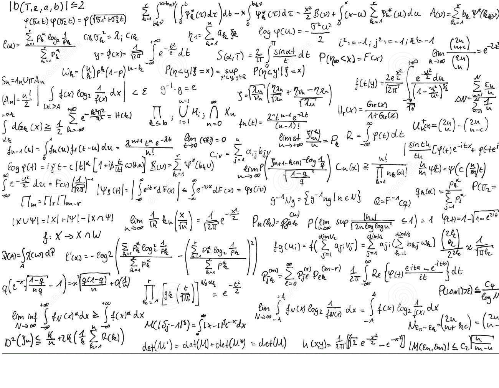

---

---

# The truth about data science: cleaning your data is 90% of the work. Fitting the model is easy. Interpreting the results is the other 90%

-- Jake VanderPlas

---

#[fit] Key Challenges for a Data Scientist

- Data Cleaning/wrangling
- Feature Engineering
- Hyperparameter Optimization
- Insights

---

#Questions?
---

# Thank you

